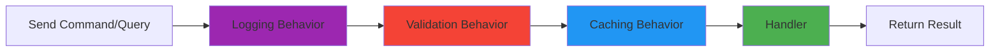

## What is CQRS?

**CQRS** (Command Query Responsibility Segregation) is a pattern that separates read operations (Queries) from write operations (Commands). This separation allows you to optimize each side independently.

### Core Principle

<Note>
  A method should either **change state** (Command) or **return data** (Query), but never both.
</Note>

This principle, known as **CQS** (Command-Query Separation), was introduced by Bertrand Meyer and forms the foundation of CQRS.

## Commands vs Queries

<CardGroup cols={2}>
  <Card title="Commands" icon="pen-to-square" color="#4CAF50">
    **Commands** change the state of the system:
    - Create, update, or delete data
    - Execute business logic
    - Trigger side effects
    - Return minimal data (usually just an ID)
    - Should be named as imperatives (Reserve, Confirm, Cancel)
  </Card>
  
  <Card title="Queries" icon="magnifying-glass" color="#2196F3">
    **Queries** return data without changing state:
    - Read data from the database
    - No side effects
    - Can be cached
    - Optimized for read performance
    - Should be named as questions (Get, Search, Find)
  </Card>
</CardGroup>

## MediatR Implementation

Bookify uses [MediatR](https://github.com/jbogard/MediatR) to implement CQRS. MediatR is a simple mediator implementation that supports request/response, commands, queries, notifications, and events.

### Setup

MediatR is registered in the Application layer:

```csharp
// src/Bookify.Application/DependencyInjection.cs:12
public static IServiceCollection AddApplication(this IServiceCollection services)
{
    services.AddMediatR(configuration =>
    {
        // Register all handlers from this assembly
        configuration.RegisterServicesFromAssembly(typeof(DependencyInjection).Assembly);
        
        // Add pipeline behaviors
        configuration.AddOpenBehavior(typeof(LoggingBehavior<,>));
        configuration.AddOpenBehavior(typeof(ValidationBehavior<,>));
        configuration.AddOpenBehavior(typeof(QueryCachingBehavior<,>));
    });
    
    // Register FluentValidation validators
    services.AddValidatorsFromAssembly(typeof(DependencyInjection).Assembly);
    
    return services;
}
```

## Commands

### Command Definition

Commands implement the `ICommand` interface:

```csharp
// src/Bookify.Application/Abstractions/Messaging/ICommand.cs:6
public interface ICommand : IRequest<Result>, IBaseCommand
{
}

public interface ICommand<TResponse> : IRequest<Result<TResponse>>, IBaseCommand
{
}
```

Example command:

```csharp
// src/Bookify.Application/Bookings/ReserveBooking/ReserveBookingCommand.cs:5
public sealed record ReserveBookingCommand(
    Guid ApartmentId,
    Guid UserId,
    DateOnly StartDate,
    DateOnly EndDate) : ICommand<Guid>;
```

<Note>
  Commands are defined as **records** for immutability and structural equality. They contain only data, no behavior.
</Note>

### Command Handler

Command handlers implement the `ICommandHandler` interface:

```csharp
// src/Bookify.Application/Abstractions/Messaging/ICommandHandler.cs
public interface ICommandHandler<TCommand> : IRequestHandler<TCommand, Result>
    where TCommand : ICommand
{
}

public interface ICommandHandler<TCommand, TResponse> : IRequestHandler<TCommand, Result<TResponse>>
    where TCommand : ICommand<TResponse>
{
}
```

Example handler:

```csharp
// src/Bookify.Application/Bookings/ReserveBooking/ReserveBookingCommandHandler.cs:17
internal sealed class ReserveBookingCommandHandler(
    IUserRepository userRepository,
    IApartmentRepository apartmentRepository,
    IBookingRepository bookingRepository,
    IUnitOfWork unitOfWork,
    PricingService pricingService,
    IDateTimeProvider dateTimeProvider)
    : ICommandHandler<ReserveBookingCommand, Guid>
{
    public async Task<Result<Guid>> Handle(
        ReserveBookingCommand request,
        CancellationToken cancellationToken)
    {
        // 1. Validate request
        var user = await userRepository.GetByIdAsync(request.UserId, cancellationToken);
        if (user is null)
        {
            return Result.Failure<Guid>(UserErrors.NotFound);
        }
        
        var apartment = await apartmentRepository.GetByIdAsync(
            request.ApartmentId,
            cancellationToken);
        if (apartment is null)
        {
            return Result.Failure<Guid>(ApartmentErrors.NotFound);
        }
        
        // 2. Check business rules
        var duration = DateRange.Create(request.StartDate, request.EndDate);
        if (await bookingRepository.IsOverlappingAsync(
            apartment,
            duration,
            cancellationToken))
        {
            return Result.Failure<Guid>(BookingErrors.Overlap);
        }
        
        // 3. Execute domain logic
        var booking = Booking.Reserve(
            apartment,
            user.Id,
            duration,
            dateTimeProvider.UtcNow,
            pricingService);
        
        // 4. Persist changes
        bookingRepository.Add(booking);
        await unitOfWork.SaveChangesAsync(cancellationToken);
        
        // 5. Return result
        return booking.Id;
    }
}
```

### Sending Commands

Commands are sent via MediatR's `ISender` (injected into controllers):

```csharp
// src/Bookify.Api/Controllers/Bookings/BookingsController.cs:24
[HttpPost]
public async Task<IActionResult> ReserveBooking(
    ReserveBookingRequest request,
    CancellationToken cancellationToken)
{
    var command = new ReserveBookingCommand(
        request.ApartmentId,
        request.UserId,
        request.StartDate,
        request.EndDate);
    
    var result = await sender.Send(command, cancellationToken);
    
    if (result.IsFailure)
    {
        return BadRequest(result.Error);
    }
    
    return CreatedAtAction(
        nameof(GetBooking),
        new { id = result.Value },
        result.Value);
}
```

## Queries

### Query Definition

Queries implement the `IQuery` interface:

```csharp
// src/Bookify.Application/Abstractions/Messaging/IQuery.cs
public interface IQuery<TResponse> : IRequest<Result<TResponse>>
{
}
```

Example query:

```csharp
// src/Bookify.Application/Apartments/SearchApartments/SearchApartmentsQuery.cs:5
public sealed record SearchApartmentsQuery(
    DateOnly StartDate,
    DateOnly EndDate) : IQuery<IReadOnlyList<ApartmentResponse>>;
```

### Query Handler

Query handlers implement the `IQueryHandler` interface:

```csharp
// src/Bookify.Application/Abstractions/Messaging/IQueryHandler.cs:6
public interface IQueryHandler<TQuery, TResponse> : IRequestHandler<TQuery, Result<TResponse>>
    where TQuery : IQuery<TResponse>
{
}
```

Example handler:

```csharp
// src/Bookify.Application/Apartments/SearchApartments/SearchApartmentsQueryHandler.cs
internal sealed class SearchApartmentsQueryHandler(
    ISqlConnectionFactory sqlConnectionFactory)
    : IQueryHandler<SearchApartmentsQuery, IReadOnlyList<ApartmentResponse>>
{
    public async Task<Result<IReadOnlyList<ApartmentResponse>>> Handle(
        SearchApartmentsQuery request,
        CancellationToken cancellationToken)
    {
        using var connection = sqlConnectionFactory.CreateConnection();
        
        const string sql = """
            SELECT
                a.id AS Id,
                a.name AS Name,
                a.description AS Description,
                a.price_amount AS Price,
                a.price_currency AS Currency,
                a.address_country AS Country,
                a.address_state AS State,
                a.address_city AS City
            FROM apartments AS a
            WHERE NOT EXISTS
            (
                SELECT 1
                FROM bookings AS b
                WHERE
                    b.apartment_id = a.id AND
                    b.duration_start <= @EndDate AND
                    b.duration_end >= @StartDate AND
                    b.status = @BookingStatus
            )
            """;
        
        var apartments = await connection.QueryAsync<ApartmentResponse, AddressResponse, ApartmentResponse>(
            sql,
            (apartment, address) =>
            {
                apartment.Address = address;
                return apartment;
            },
            new
            {
                request.StartDate,
                request.EndDate,
                BookingStatus = (int)BookingStatus.Reserved
            },
            splitOn: "Country");
        
        return apartments.ToList();
    }
}
```

<Note>
  This query uses **Dapper** for performance. Queries bypass the ORM and use raw SQL for optimal read performance.
</Note>

### Query Response DTOs

```csharp
// src/Bookify.Application/Apartments/SearchApartments/ApartmentResponse.cs
public sealed class ApartmentResponse
{
    public Guid Id { get; init; }
    public string Name { get; init; }
    public string Description { get; init; }
    public decimal Price { get; init; }
    public string Currency { get; init; }
    public AddressResponse Address { get; set; }
}

public sealed class AddressResponse
{
    public string Country { get; init; }
    public string State { get; init; }
    public string City { get; init; }
}
```

## Pipeline Behaviors

MediatR supports **pipeline behaviors** that wrap the execution of handlers. Bookify uses three behaviors:

### 1. Logging Behavior

Logs all requests and their execution time:

```csharp
// src/Bookify.Application/Abstractions/Behaviors/LoggingBehavior.cs
internal sealed class LoggingBehavior<TRequest, TResponse>(
    ILogger<LoggingBehavior<TRequest, TResponse>> logger)
    : IPipelineBehavior<TRequest, TResponse>
    where TRequest : IBaseCommand
{
    public async Task<TResponse> Handle(
        TRequest request,
        RequestHandlerDelegate<TResponse> next,
        CancellationToken cancellationToken)
    {
        var requestName = typeof(TRequest).Name;
        
        logger.LogInformation("Processing request {RequestName}", requestName);
        
        var stopwatch = Stopwatch.StartNew();
        var response = await next();
        stopwatch.Stop();
        
        logger.LogInformation(
            "Completed request {RequestName} in {ElapsedMilliseconds}ms",
            requestName,
            stopwatch.ElapsedMilliseconds);
        
        return response;
    }
}
```

### 2. Validation Behavior

Validates commands using FluentValidation:

```csharp
// src/Bookify.Application/Abstractions/Behaviors/ValidationBehavior.cs:8
internal sealed class ValidationBehavior<TRequest, TResponse>(
    IEnumerable<IValidator<TRequest>> validators)
    : IPipelineBehavior<TRequest, TResponse>
    where TRequest : IBaseCommand
{
    public async Task<TResponse> Handle(
        TRequest request,
        RequestHandlerDelegate<TResponse> next,
        CancellationToken cancellationToken)
    {
        if (!validators.Any())
        {
            return await next();
        }
        
        var context = new ValidationContext<TRequest>(request);
        
        var validationErrors = validators
            .Select(validator => validator.Validate(context))
            .Where(validationResult => validationResult.Errors.Any())
            .SelectMany(validationResult => validationResult.Errors)
            .Select(validationFailure => new ValidationError(
                validationFailure.PropertyName,
                validationFailure.ErrorMessage))
            .ToList();
        
        if (validationErrors.Any())
        {
            throw new ValidationException(validationErrors);
        }
        
        return await next();
    }
}
```

Example validator:

```csharp
// src/Bookify.Application/Bookings/ReserveBooking/ReserveBookingCommandValidator.cs
internal sealed class ReserveBookingCommandValidator : AbstractValidator<ReserveBookingCommand>
{
    public ReserveBookingCommandValidator()
    {
        RuleFor(x => x.UserId).NotEmpty();
        RuleFor(x => x.ApartmentId).NotEmpty();
        RuleFor(x => x.StartDate).LessThan(x => x.EndDate);
    }
}
```

### 3. Query Caching Behavior

Caches query results in Redis:

```csharp
// src/Bookify.Application/Abstractions/Behaviors/QueryCachingBehavior.cs
internal sealed class QueryCachingBehavior<TRequest, TResponse>(
    ICacheService cacheService,
    ILogger<QueryCachingBehavior<TRequest, TResponse>> logger)
    : IPipelineBehavior<TRequest, TResponse>
    where TRequest : ICachedQuery
    where TResponse : Result
{
    public async Task<TResponse> Handle(
        TRequest request,
        RequestHandlerDelegate<TResponse> next,
        CancellationToken cancellationToken)
    {
        var cachedResult = await cacheService.GetAsync<TResponse>(
            request.CacheKey,
            cancellationToken);
        
        if (cachedResult is not null)
        {
            logger.LogInformation("Cache hit for {CacheKey}", request.CacheKey);
            return cachedResult;
        }
        
        logger.LogInformation("Cache miss for {CacheKey}", request.CacheKey);
        
        var response = await next();
        
        if (response.IsSuccess)
        {
            await cacheService.SetAsync(
                request.CacheKey,
                response,
                request.Expiration,
                cancellationToken);
        }
        
        return response;
    }
}
```

To enable caching for a query, implement `ICachedQuery`:

```csharp
public sealed record GetBookingQuery(Guid BookingId) 
    : IQuery<BookingResponse>, ICachedQuery
{
    public string CacheKey => $"booking-{BookingId}";
    public TimeSpan? Expiration => TimeSpan.FromMinutes(5);
}
```

## Request Pipeline Flow

When you send a command or query, it flows through the pipeline:



<Steps>
  <Step title="Logging">
    Request is logged with timestamp
  </Step>
  
  <Step title="Validation">
    Command is validated (queries skip this)
  </Step>
  
  <Step title="Caching">
    Check cache for queries (commands skip this)
  </Step>
  
  <Step title="Handler">
    Execute the actual handler logic
  </Step>
  
  <Step title="Response">
    Return result through the pipeline
  </Step>
</Steps>

## Benefits of CQRS in Bookify

<CardGroup cols={2}>
  <Card title="Optimized Operations" icon="gauge-high">
    Commands use EF Core for change tracking. Queries use Dapper for raw SQL performance.
  </Card>
  
  <Card title="Scalability" icon="arrows-up-down">
    Read and write databases can be separated. Read replicas can handle query load.
  </Card>
  
  <Card title="Caching" icon="layer-group">
    Only queries are cached. Commands always hit the database.
  </Card>
  
  <Card title="Clarity" icon="lightbulb">
    Clear separation between operations that change state and those that read data.
  </Card>
</CardGroup>

## Command vs Query Examples

### Commands in Bookify

- `ReserveBookingCommand` - Creates a new booking
- `ConfirmBookingCommand` - Confirms a reserved booking
- `CancelBookingCommand` - Cancels a confirmed booking
- `RegisterUserCommand` - Registers a new user
- `LoginUserCommand` - Authenticates a user

### Queries in Bookify

- `SearchApartmentsQuery` - Finds available apartments
- `GetBookingQuery` - Retrieves a booking by ID
- `GetLoggedInUserQuery` - Gets the current user

## Testing Commands and Queries

### Testing a Command Handler

```csharp
public class ReserveBookingCommandHandlerTests
{
    [Fact]
    public async Task Handle_ShouldReturnSuccess_WhenBookingIsValid()
    {
        // Arrange
        var userRepositoryMock = new Mock<IUserRepository>();
        var apartmentRepositoryMock = new Mock<IApartmentRepository>();
        var bookingRepositoryMock = new Mock<IBookingRepository>();
        var unitOfWorkMock = new Mock<IUnitOfWork>();
        
        userRepositoryMock
            .Setup(x => x.GetByIdAsync(It.IsAny<Guid>(), It.IsAny<CancellationToken>()))
            .ReturnsAsync(UserData.Create());
        
        apartmentRepositoryMock
            .Setup(x => x.GetByIdAsync(It.IsAny<Guid>(), It.IsAny<CancellationToken>()))
            .ReturnsAsync(ApartmentData.Create());
        
        bookingRepositoryMock
            .Setup(x => x.IsOverlappingAsync(
                It.IsAny<Apartment>(),
                It.IsAny<DateRange>(),
                It.IsAny<CancellationToken>()))
            .ReturnsAsync(false);
        
        var handler = new ReserveBookingCommandHandler(
            userRepositoryMock.Object,
            apartmentRepositoryMock.Object,
            bookingRepositoryMock.Object,
            unitOfWorkMock.Object,
            new PricingService(),
            new FakeDateTimeProvider());
        
        var command = new ReserveBookingCommand(
            Guid.NewGuid(),
            Guid.NewGuid(),
            DateOnly.FromDateTime(DateTime.UtcNow),
            DateOnly.FromDateTime(DateTime.UtcNow.AddDays(7)));
        
        // Act
        var result = await handler.Handle(command, default);
        
        // Assert
        result.IsSuccess.Should().BeTrue();
        result.Value.Should().NotBeEmpty();
        bookingRepositoryMock.Verify(x => x.Add(It.IsAny<Booking>()), Times.Once);
        unitOfWorkMock.Verify(x => x.SaveChangesAsync(It.IsAny<CancellationToken>()), Times.Once);
    }
}
```

### Testing a Query Handler

```csharp
public class SearchApartmentsQueryHandlerTests
{
    [Fact]
    public async Task Handle_ShouldReturnApartments_WhenApartmentsExist()
    {
        // Arrange
        var sqlConnectionFactoryMock = new Mock<ISqlConnectionFactory>();
        var connectionMock = new Mock<IDbConnection>();
        
        sqlConnectionFactoryMock
            .Setup(x => x.CreateConnection())
            .Returns(connectionMock.Object);
        
        var handler = new SearchApartmentsQueryHandler(sqlConnectionFactoryMock.Object);
        
        var query = new SearchApartmentsQuery(
            DateOnly.FromDateTime(DateTime.UtcNow),
            DateOnly.FromDateTime(DateTime.UtcNow.AddDays(7)));
        
        // Act
        var result = await handler.Handle(query, default);
        
        // Assert
        result.IsSuccess.Should().BeTrue();
        result.Value.Should().NotBeNull();
    }
}
```

## Best Practices

<Warning>
  **Never** put business logic in handlers. Handlers should orchestrate, domain entities should contain logic.
</Warning>

<Note>
  Keep commands and queries **immutable** by using records. This prevents accidental modifications.
</Note>

<Accordion title="When to use EF Core vs Dapper?">
  - **Commands**: Use EF Core for change tracking and navigation property loading
  - **Queries**: Use Dapper for complex queries and better performance
  - **Simple reads**: EF Core is fine for simple Get by ID operations
</Accordion>

<Accordion title="Should every command have a validator?">
  Yes, even if it's simple. Validation should happen before the handler executes. This catches errors early and provides clear error messages.
</Accordion>

<Accordion title="Can commands return data?">
  Commands should return minimal data - typically just an ID or a success indicator. If you need to return the full created entity, the client should follow up with a query.
</Accordion>

## Next Steps

<CardGroup cols={2}>
  <Card title="Domain-Driven Design" icon="puzzle-piece" href="/architecture/domain-driven-design">
    Learn about aggregates, entities, and value objects
  </Card>
  
  <Card title="Project Structure" icon="folder-tree" href="/architecture/project-structure">
    Explore the directory organization
  </Card>
</CardGroup>
