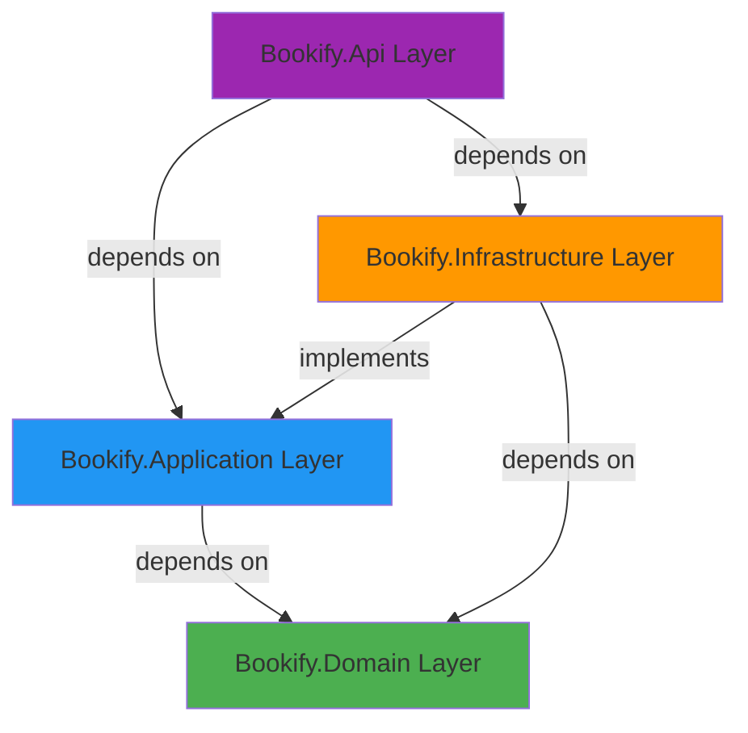

## Introduction

Bookify is built using a modern, maintainable architecture that combines three powerful design patterns:

- **Clean Architecture** - Separation of concerns with clear dependency rules
- **CQRS** (Command Query Responsibility Segregation) - Separate read and write operations
- **DDD** (Domain-Driven Design) - Rich domain models with business logic

This combination creates a highly testable, maintainable, and scalable application.

## Architecture Layers

Bookify follows Clean Architecture's layered approach with four distinct projects:



### Layer Responsibilities

<CardGroup cols={2}>
  <Card title="Domain Layer" icon="cube" color="#4CAF50">
    Core business logic, entities, value objects, domain events, and business rules. No external dependencies.
  </Card>
  
  <Card title="Application Layer" icon="gears" color="#2196F3">
    Use cases, CQRS handlers, validation, and application services. Orchestrates domain logic.
  </Card>
  
  <Card title="Infrastructure Layer" icon="database" color="#FF9800">
    Data access, external services, EF Core, caching, authentication, and third-party integrations.
  </Card>
  
  <Card title="API Layer" icon="globe" color="#9C27B0">
    HTTP endpoints, controllers, middleware, and API contracts. Entry point for client requests.
  </Card>
</CardGroup>

## Data Flow Through the System

Here's how a typical request flows through Bookify:

<Steps>
  <Step title="Client Request">
    A client sends an HTTP request to a controller endpoint.
    
    ```csharp
    // src/Bookify.Api/Controllers/Bookings/BookingsController.cs:24
    [HttpPost]
    public async Task<IActionResult> ReserveBooking(
        ReserveBookingRequest request,
        CancellationToken cancellationToken)
    {
        var command = new ReserveBookingCommand(
            request.ApartmentId,
            request.UserId,
            request.StartDate,
            request.EndDate);
            
        var result = await sender.Send(command, cancellationToken);
        // ...
    }
    ```
  </Step>

  <Step title="Command/Query Creation">
    The controller creates a Command or Query object and sends it via MediatR.
  </Step>

  <Step title="Pipeline Behaviors">
    MediatR pipeline behaviors execute in order:
    - **Logging** - Logs the request
    - **Validation** - Validates using FluentValidation
    - **Caching** - Checks cache for queries
  </Step>

  <Step title="Handler Execution">
    The appropriate handler processes the command/query:
    - Retrieves entities from repositories
    - Executes domain logic
    - Persists changes via Unit of Work
  </Step>

  <Step title="Domain Events">
    Domain events are collected and published during SaveChanges.
    
    ```csharp
    // src/Bookify.Infrastructure/ApplicationDbContext.cs:40
    private async Task PublishDomainEventsAsync()
    {
        var domainEvents = ChangeTracker
            .Entries<Entity>()
            .SelectMany(entity => entity.GetDomainEvents());
            
        foreach (var domainEvent in domainEvents)
        {
            await _publisher.Publish(domainEvent);
        }
    }
    ```
  </Step>

  <Step title="Response">
    The handler returns a Result object, which the controller converts to an HTTP response.
  </Step>
</Steps>

## Key Benefits

### Separation of Concerns

Each layer has a single, well-defined responsibility. Business logic lives in the domain, infrastructure concerns are isolated, and the API layer only handles HTTP concerns.

### Testability

The architecture makes testing straightforward:
- **Domain Layer** - Pure business logic, no dependencies
- **Application Layer** - Mock repositories and services
- **Infrastructure Layer** - Integration tests with real databases
- **API Layer** - API tests via TestServer

### Maintainability

Clear boundaries between layers make the codebase easy to navigate and modify. Changes to infrastructure don't affect business logic, and vice versa.

### Flexibility

You can swap implementations without affecting other layers. For example:
- Switch from PostgreSQL to SQL Server
- Replace Redis cache with in-memory cache
- Change authentication from Keycloak to Azure AD

<Note>
  All dependencies point inward toward the Domain layer. The Domain never depends on Infrastructure or Application.
</Note>

## Dependency Inversion

Bookify uses dependency inversion extensively. The Application layer defines abstractions (interfaces), and the Infrastructure layer provides implementations:

```csharp
// Application defines the contract
// src/Bookify.Application/Abstractions/Email/IEmailService.cs
public interface IEmailService
{
    Task SendAsync(string recipient, string subject, string body);
}

// Infrastructure provides the implementation
// src/Bookify.Infrastructure/Email/EmailService.cs
public class EmailService : IEmailService
{
    public async Task SendAsync(string recipient, string subject, string body)
    {
        // Implementation details...
    }
}
```

This is registered in the DI container:

```csharp
// src/Bookify.Infrastructure/DependencyInjection.cs:42
services.AddTransient<IEmailService, EmailService>();
```

## Application Startup

The application is composed at the entry point:

```csharp
// src/Bookify.Api/Program.cs:17
builder.Services
    .AddApplication()      // Register Application layer services
    .AddInfrastructure(builder.Configuration);  // Register Infrastructure services
```

<Accordion title="What gets registered?">
  **Application Layer**:
  - MediatR with all handlers
  - Pipeline behaviors (Logging, Validation, Caching)
  - FluentValidation validators
  - Domain services (PricingService)

  **Infrastructure Layer**:
  - DbContext and EF Core
  - Repositories
  - Authentication (JWT, Keycloak)
  - Authorization (Permissions)
  - Caching (Redis)
  - Health checks
</Accordion>

## Next Steps

<CardGroup cols={2}>
  <Card title="Clean Architecture" icon="layer-group" href="/architecture/clean-architecture">
    Deep dive into the four layers and dependency rules
  </Card>
  
  <Card title="CQRS Pattern" icon="split" href="/architecture/cqrs-pattern">
    Learn how commands and queries are separated
  </Card>
  
  <Card title="Domain-Driven Design" icon="puzzle-piece" href="/architecture/domain-driven-design">
    Explore aggregates, entities, and value objects
  </Card>
  
  <Card title="Project Structure" icon="folder-tree" href="/architecture/project-structure">
    Understand the directory organization
  </Card>
</CardGroup>
