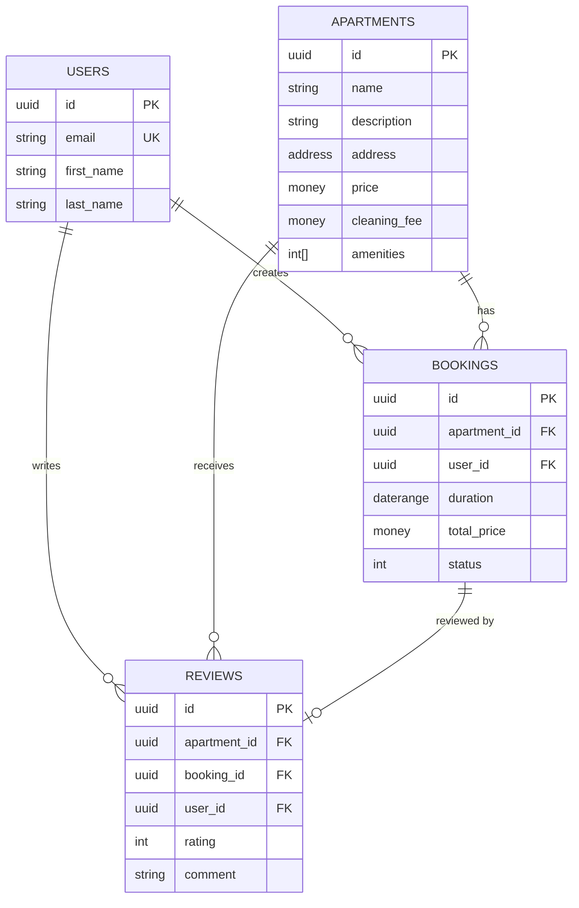

Bookify uses PostgreSQL as its primary database with Entity Framework Core as the ORM. This guide covers database configuration, migrations, seeding, and schema overview.

## Overview

The database stack consists of:
- **PostgreSQL**: Relational database
- **Entity Framework Core**: ORM with code-first migrations
- **Npgsql**: PostgreSQL provider for .NET
- **Dapper**: Lightweight SQL mapper for queries

## PostgreSQL Setup

### Configuration

Database connection string is configured in `appsettings.Development.json`:

```json
"ConnectionStrings": {
  "Database": "Server=localhost;Port=4001;Database=BookifyDb;User Id=postgres;Password=postgres;Include Error Detail=true"
}
```

### Docker Compose Configuration

PostgreSQL runs as a containerized service:

```yaml
services:
  bookify-db:
    image: postgres:latest
    container_name: Bookify.Db
    environment:
      - POSTGRES_USER=postgres
      - POSTGRES_PASSWORD=postgres
      - POSTGRES_DB=BookifyDb
    restart: always
    ports:
      - "4001:5432"
    volumes:
      - postgres_bookifydb:/var/lib/postgresql/data/

volumes:
  postgres_bookifydb:
```

<Note>
The database is accessible on host port `4001` to avoid conflicts with local PostgreSQL installations on the default port `5432`.
</Note>

### Dependency Injection

Database context is configured in src/Bookify.Infrastructure/DependencyInjection.cs:57:

```csharp
private static void AddPersistence(IServiceCollection services, IConfiguration configuration)
{
    var connectionString =
        configuration.GetConnectionString("Database") ??
        throw new ArgumentNullException(nameof(configuration));

    services.AddDbContext<ApplicationDbContext>(options =>
    {
        options.UseNpgsql(connectionString).UseSnakeCaseNamingConvention();
    });

    services.AddScoped<IUserRepository, UserRepository>();
    services.AddScoped<IApartmentRepository, ApartmentRepository>();
    services.AddScoped<IBookingRepository, BookingRepository>();
    services.AddScoped<IReviewRepository, ReviewRepository>();
    services.AddScoped<IUnitOfWork>(sp => sp.GetRequiredService<ApplicationDbContext>());

    services.AddSingleton<ISqlConnectionFactory>(_ =>
        new SqlConnectionFactory(connectionString));

    SqlMapper.AddTypeHandler(new DateOnlyTypeHandler());
}
```

## Database Context

The `ApplicationDbContext` (src/Bookify.Infrastructure/ApplicationDbContext.cs:8) serves as the EF Core database context:

```csharp
public sealed class ApplicationDbContext : DbContext, IUnitOfWork
{
    private readonly IPublisher _publisher;

    public ApplicationDbContext(DbContextOptions<ApplicationDbContext> options, IPublisher publisher) 
        : base(options)
    {
        _publisher = publisher;
    }

    protected override void OnModelCreating(ModelBuilder modelBuilder)
    {
        modelBuilder.ApplyConfigurationsFromAssembly(typeof(ApplicationDbContext).Assembly);
        base.OnModelCreating(modelBuilder);
    }

    public async Task<int> SaveChangesAsync(CancellationToken cancellationToken = default)
    {
        try
        {
            await PublishDomainEventsAsync();
            var result = base.SaveChangesAsync(cancellationToken);
            return await result;
        }
        catch (DbUpdateConcurrencyException ex)
        {
            throw new ConcurrencyException("Concurrency exception occurred.", ex);
        }
    }
}
```

**Key Features:**
- **Domain Events**: Publishes domain events before saving changes
- **Concurrency Handling**: Detects and handles concurrent updates
- **Configuration**: Auto-discovers entity configurations from assembly

## Entity Framework Migrations

### Creating Migrations

<Steps>

### Install EF Core Tools

```bash
dotnet tool install --global dotnet-ef
```

### Create a new migration

Navigate to the Infrastructure project directory:

```bash
cd src/Bookify.Infrastructure

dotnet ef migrations add YourMigrationName \
  --startup-project ../Bookify.Api/Bookify.Api.csproj
```

### Review the migration

Migrations are created in `src/Bookify.Infrastructure/Migrations/`:

```csharp
public partial class Create_Database : Migration
{
    protected override void Up(MigrationBuilder migrationBuilder)
    {
        migrationBuilder.CreateTable(
            name: "apartments",
            columns: table => new
            {
                id = table.Column<Guid>(type: "uuid", nullable: false),
                name = table.Column<string>(type: "character varying(200)", maxLength: 200, nullable: false),
                // ... more columns
            });
    }
}
```

### Apply the migration

Migrations are automatically applied on application startup in development mode.

</Steps>

### Automatic Migration Application

The `ApplyMigrations` extension method (src/Bookify.Api/Extensions/ApplicationBuilderExtensions.cs:9) runs migrations on startup:

```csharp
public static void ApplyMigrations(this IApplicationBuilder app)
{
    using var scope = app.ApplicationServices.CreateScope();
    var services = scope.ServiceProvider;
    var logger = services.GetRequiredService<ILogger<Program>>();
    var context = services.GetRequiredService<ApplicationDbContext>();
    
    try
    {
        logger.LogInformation("Applying migrations...");
        context.Database.Migrate();
        logger.LogInformation("Migrations applied successfully");
    }
    catch (Exception ex)
    {
        logger.LogError(ex, "An error occurred while applying migrations");
    }
}
```

This is called in `Program.cs` during development:

```csharp
if (app.Environment.IsDevelopment())
{
    app.ApplyMigrations();
    app.SeedData();
}
```

<Warning>
Automatic migrations should only run in development. In production, use a dedicated deployment process to apply migrations.
</Warning>

## Seeding Data

### Seed Extension Method

The `SeedData` extension (src/Bookify.Api/Extensions/SeedDataExtensions.cs:10) populates the database with test data:

```csharp
public static void SeedData(this IApplicationBuilder app)
{
    using var scope = app.ApplicationServices.CreateScope();

    var sqlConnectionFactory = scope.ServiceProvider.GetRequiredService<ISqlConnectionFactory>();
    using var connection = sqlConnectionFactory.CreateConnection();

    var faker = new Faker();

    List<object> apartments = [];
    for (var i = 0; i < 100; i++)
    {
        apartments.Add(new
        {
            Id = Guid.NewGuid(),
            Name = faker.Company.CompanyName(),
            Description = "Amazing view",
            Country = faker.Address.Country(),
            State = faker.Address.State(),
            ZipCode = faker.Address.ZipCode(),
            City = faker.Address.City(),
            Street = faker.Address.StreetAddress(),
            PriceAmount = faker.Random.Decimal(50, 1000),
            PriceCurrency = "USD",
            CleaningFeeAmount = faker.Random.Decimal(25, 200),
            CleaningFeeCurrency = "USD",
            Amenities = new List<int> { (int)Amenity.Parking, (int)Amenity.MountainView },
            LastBookedOn = DateTime.MinValue
        });
    }

    const string sql = """
        INSERT INTO public.apartments
        (id, "name", description, address_country, address_state, address_zip_code, 
         address_city, address_street, price_amount, price_currency, cleaning_fee_amount, 
         cleaning_fee_currency, amenities, last_booked_on_utc)
        VALUES(@Id, @Name, @Description, @Country, @State, @ZipCode, @City, @Street, 
               @PriceAmount, @PriceCurrency, @CleaningFeeAmount, @CleaningFeeCurrency, 
               @Amenities, @LastBookedOn);
        """;

    connection.Execute(sql, apartments);
}
```

**Generates:**
- 100 sample apartments using Bogus faker library
- Realistic addresses, prices, and amenities

## Database Schema

The initial migration (src/Bookify.Infrastructure/Migrations/20241219181115_Create_Database.cs:12) creates the following schema:

### Tables

<AccordionGroup>
  <Accordion title="apartments">
    Stores apartment listings.
    
    ```sql
    CREATE TABLE apartments (
        id uuid PRIMARY KEY,
        name varchar(200) NOT NULL,
        description varchar(2000) NOT NULL,
        address_country text NOT NULL,
        address_state text NOT NULL,
        address_city text NOT NULL,
        address_zip_code text NOT NULL,
        address_street text NOT NULL,
        price_amount numeric NOT NULL,
        price_currency text NOT NULL,
        cleaning_fee_amount numeric NOT NULL,
        cleaning_fee_currency text NOT NULL,
        last_booked_on_utc timestamptz,
        amenities integer[],
        xmin xid  -- Optimistic concurrency token
    );
    ```
  </Accordion>

  <Accordion title="users">
    Stores user accounts.
    
    ```sql
    CREATE TABLE users (
        id uuid PRIMARY KEY,
        first_name varchar(200) NOT NULL,
        last_name varchar(200) NOT NULL,
        email varchar(400) NOT NULL
    );
    
    CREATE UNIQUE INDEX ix_users_email ON users(email);
    ```
  </Accordion>

  <Accordion title="bookings">
    Stores apartment reservations.
    
    ```sql
    CREATE TABLE bookings (
        id uuid PRIMARY KEY,
        apartment_id uuid NOT NULL REFERENCES apartments(id),
        user_id uuid NOT NULL REFERENCES users(id),
        duration_start date NOT NULL,
        duration_end date NOT NULL,
        price_for_period_amount numeric NOT NULL,
        price_for_period_currency text NOT NULL,
        cleaning_fee_amount numeric NOT NULL,
        cleaning_fee_currency text NOT NULL,
        amenities_up_charge_amount numeric NOT NULL,
        amenities_up_charge_currency text NOT NULL,
        total_price_amount numeric NOT NULL,
        total_price_currency text NOT NULL,
        status integer NOT NULL,
        created_on_utc timestamptz NOT NULL,
        confirmed_on_utc timestamptz,
        rejected_on_utc timestamptz,
        completed_on_utc timestamptz,
        cancelled_on_utc timestamptz
    );
    
    CREATE INDEX ix_bookings_apartment_id ON bookings(apartment_id);
    CREATE INDEX ix_bookings_user_id ON bookings(user_id);
    ```
  </Accordion>

  <Accordion title="reviews">
    Stores booking reviews.
    
    ```sql
    CREATE TABLE reviews (
        id uuid PRIMARY KEY,
        apartment_id uuid NOT NULL REFERENCES apartments(id),
        booking_id uuid NOT NULL REFERENCES bookings(id),
        user_id uuid NOT NULL REFERENCES users(id),
        rating integer NOT NULL,
        comment varchar(200) NOT NULL,
        created_on_utc timestamptz NOT NULL
    );
    
    CREATE INDEX ix_reviews_apartment_id ON reviews(apartment_id);
    CREATE INDEX ix_reviews_booking_id ON reviews(booking_id);
    CREATE INDEX ix_reviews_user_id ON reviews(user_id);
    ```
  </Accordion>
</AccordionGroup>

### Entity Relationships



## Naming Convention

Bookify uses **snake_case** for database identifiers via the `UseSnakeCaseNamingConvention()` extension:

| C# Property | Database Column |
|-------------|----------------|
| `FirstName` | `first_name` |
| `CreatedOnUtc` | `created_on_utc` |
| `ApartmentId` | `apartment_id` |

## Querying with Dapper

For read-heavy operations, use Dapper with `ISqlConnectionFactory`:

```csharp
public class SearchApartmentsQueryHandler
{
    private readonly ISqlConnectionFactory _sqlConnectionFactory;

    public async Task<IReadOnlyList<ApartmentResponse>> Handle(
        SearchApartmentsQuery request,
        CancellationToken cancellationToken)
    {
        using var connection = _sqlConnectionFactory.CreateConnection();

        const string sql = """
            SELECT 
                id,
                name,
                description,
                price_amount,
                price_currency,
                address_country,
                address_city
            FROM apartments
            WHERE NOT EXISTS (
                SELECT 1 FROM bookings
                WHERE bookings.apartment_id = apartments.id
                AND bookings.duration_start <= @EndDate
                AND bookings.duration_end >= @StartDate
                AND bookings.status = @Status
            )
            """;

        var apartments = await connection.QueryAsync<ApartmentResponse>(
            sql,
            new { request.StartDate, request.EndDate, Status = BookingStatus.Reserved });

        return apartments.ToList();
    }
}
```

**Benefits:**
- Better performance for read queries
- Full control over SQL
- No tracking overhead

## Production Considerations

<CardGroup cols={2}>
  <Card title="Connection Pooling" icon="share-nodes">
    Npgsql uses connection pooling by default. Configure pool size via connection string:
    ```
    Minimum Pool Size=10;Maximum Pool Size=100
    ```
  </Card>

  <Card title="Migration Strategy" icon="code-branch">
    - Use a CI/CD pipeline to apply migrations
    - Test migrations in staging first
    - Create rollback scripts
    - Never auto-migrate in production
  </Card>

  <Card title="Backup Strategy" icon="floppy-disk">
    - Automated daily backups
    - Point-in-time recovery enabled
    - Test restore procedures regularly
    - Store backups off-site
  </Card>

  <Card title="Monitoring" icon="chart-line">
    - Query performance metrics
    - Connection pool statistics
    - Database size and growth
    - Slow query log analysis
  </Card>
</CardGroup>

## Troubleshooting

### Connection Failed

```
Npgsql.NpgsqlException: Failed to connect to [::1]:4001
```

**Solutions:**
- Verify PostgreSQL container is running: `docker ps | grep bookify-db`
- Check connection string configuration
- Ensure correct port (4001)
- Test connectivity: `docker exec -it Bookify.Db psql -U postgres`

### Migration Errors

```
The migration has already been applied to the database
```

**Solutions:**
- Check `__EFMigrationsHistory` table
- Remove incomplete migration: `dotnet ef migrations remove`
- Manually delete migration from history table if needed

### Concurrency Conflicts

```
ConcurrencyException: The record being updated has been modified by another process
```

**Solutions:**
- Refresh entity from database
- Implement retry logic
- Review optimistic concurrency strategy

## Next Steps

<CardGroup cols={2}>
  <Card title="Health Checks" icon="heart-pulse" href="/guides/health-checks">
    Monitor database connectivity
  </Card>
  <Card title="Docker Deployment" icon="docker" href="/guides/docker-deployment">
    Deploy with Docker Compose
  </Card>
</CardGroup>